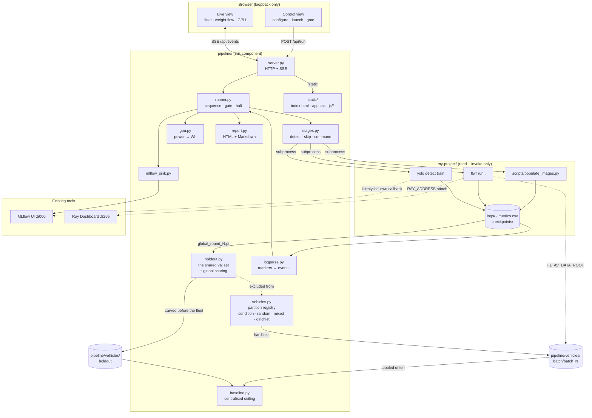
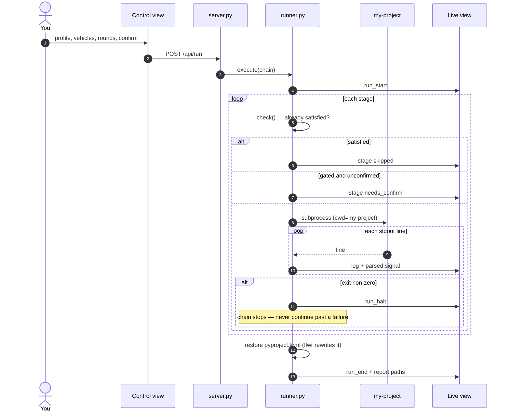
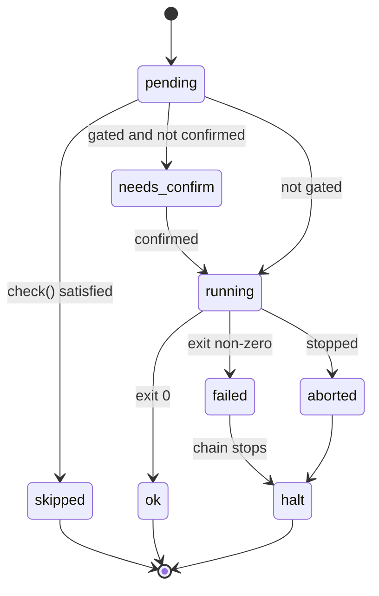

# Pipeline + fleet observability — architecture

One command reproduces the federated-YOLOv8 flow; two dashboards explain it while it
runs. The observability is **assembled from existing tools**, not built: MLflow owns
metrics and history, the Ray Dashboard owns actor and GPU internals. The only custom
UI is what neither can do — launch a run, and narrate a fleet of vehicles.

Design record: [`../../docs/superpowers/specs/2026-08-05-pipeline-observability-design.md`](../../docs/superpowers/specs/2026-08-05-pipeline-observability-design.md)

## The isolation rule

`pipeline/` **invokes** `my-project` and **reads** its outputs. It never imports its
internals and never writes into its tree. This is enforced, not promised:
`test_pipeline.py::test_pipeline_never_writes_into_my_project` fails the build if any
write call in this package targets `PROJECT`.

The one thing that would normally force a change to `my-project` — pointing the
federation at simulated vehicle shards — is avoided by reusing the `FL_AV_DATA_ROOT`
environment variable that `task.py` already honours.

## Components

Two independent writers reach MLflow, by design: Ultralytics logs **per-vehicle
training** through the callback it already ships, and `mlflow_sink` logs
**federation-level** facts no single training run can see — the round-over-round
aggregate checksum, which vehicle held which shard, and what the run cost in watt-hours.

## A run, end to end

## Stage lifecycle

## Stages

| Stage | Runs | Skips when | Gated |
|---|---|---|---|
| `env` | torch + CUDA capability probe | never | no |
| `dataset` | `kagglehub.dataset_download` | pool has 10 000 val images | **yes** |
| `populate` | `scripts/populate_images.py` | every shard matches its split list | no |
| `holdout` | `pipeline.holdout --build` | the carved set matches size and seed | no |
| `fleet` | `pipeline.build_fleet` | the manifest matches partition, α, seed, per-vehicle count **and holdout size** | no |
| `sanity` | one-epoch `yolo detect train` | marker from a previous pass | **yes** |
| `federate` | `flwr run . --stream` | never | **yes** |
| `evaluate` | `pipeline.holdout --evaluate` | never | no |
| `verify` | the four pass criteria | never | no |
| `baseline` | `pipeline.baseline` | a centralised run exists at this budget | **yes** |

Gating exists so a browser tab cannot start a multi-hour GPU job unprompted. A test
asserts `dataset`, `sanity`, `federate` and `baseline` are all gated.

**`holdout` before `fleet` is load-bearing.** It carves a val slice that `build_fleet`
subtracts from the pool, so no vehicle can train or self-evaluate on it. Carved the
other way round, the holdout would already sit inside somebody's val split and the
"global" metric would be partly self-referential — the exact shape of silent failure
this project keeps producing. The fleet manifest records the holdout size, so a fleet
built against a different one is rebuilt rather than reused.

## Why the fleet is condition-biased

Handing every vehicle a random shard makes their curves converge to the same shape,
and the fleet view says nothing. Each vehicle is instead biased toward a driving
condition from BDD100K's own attributes (`weather`, `scene`, `timeofday`), so
divergence between vehicles is visible — which is the thing that makes this federated
rather than merely distributed.

Slices are **disjoint**: overlap would train one image on two vehicles per round and
quietly flatter the aggregate. The 1.45 GB attribute file is streamed with `ijson` and
cached, because `json.loads` on it would allocate several GB to produce objects that
are immediately discarded.

## What the live view is actually watching

The signals below already exist in `my-project`'s logs. Nothing was added there.

| Marker | Meaning in the UI |
|---|---|
| `Aggregated parameters with checksum` | the weight-flow chart — **identical consecutive values mean the federation is not learning** |
| `Received` / `Sending back weights with checksum` | per-vehicle received → sent → delta |
| `Starting local training with batch_id=N` | which vehicle is training now |
| `fewer than the N needed for one optimizer step` | the round cannot change the weights; surfaced loudly because it looks exactly like the B4 bug |

## Costs and limits

- Vehicles train **serialised**. One client peaks at 15.9 GB of 16.3 GB, so
  `client-resources.num-gpus = 1.0` is required and wall clock scales linearly with
  vehicle count.
- `demo` profile: 300 images/vehicle at 320 px, minutes. `full`: 6 308 at 640 px, hours.
- The server binds `127.0.0.1` only and stores nothing.
- No credentials anywhere: kagglehub downloads anonymously.
